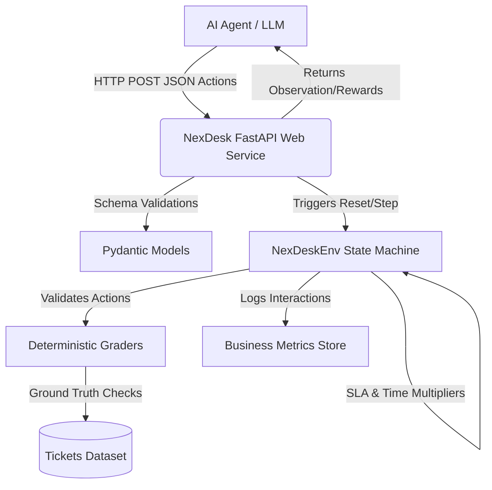
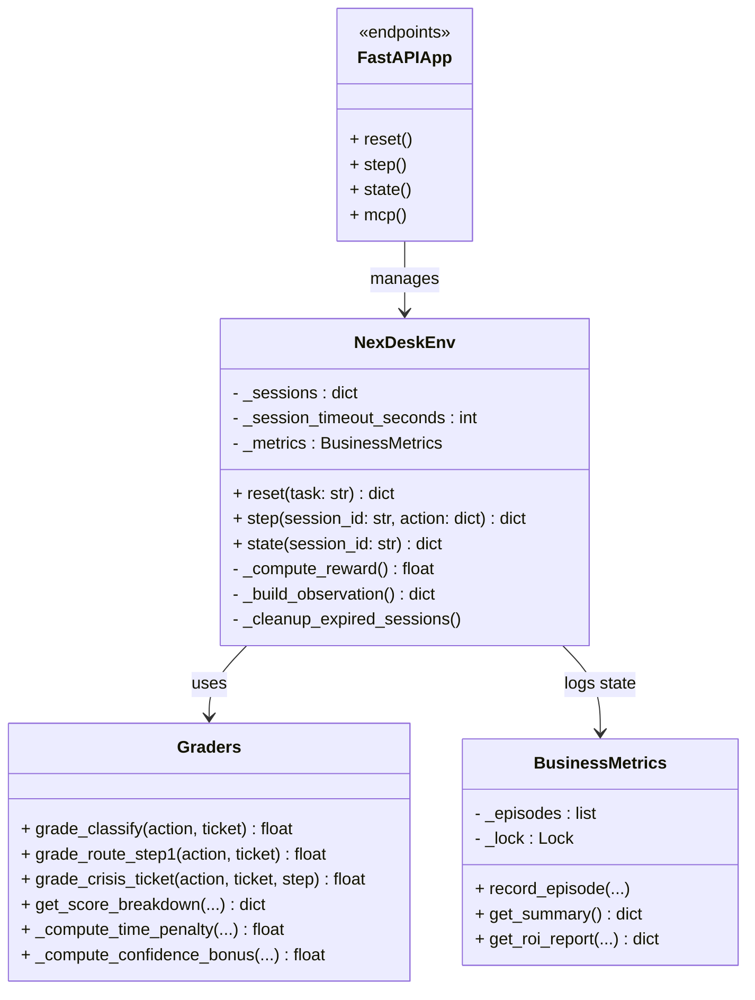
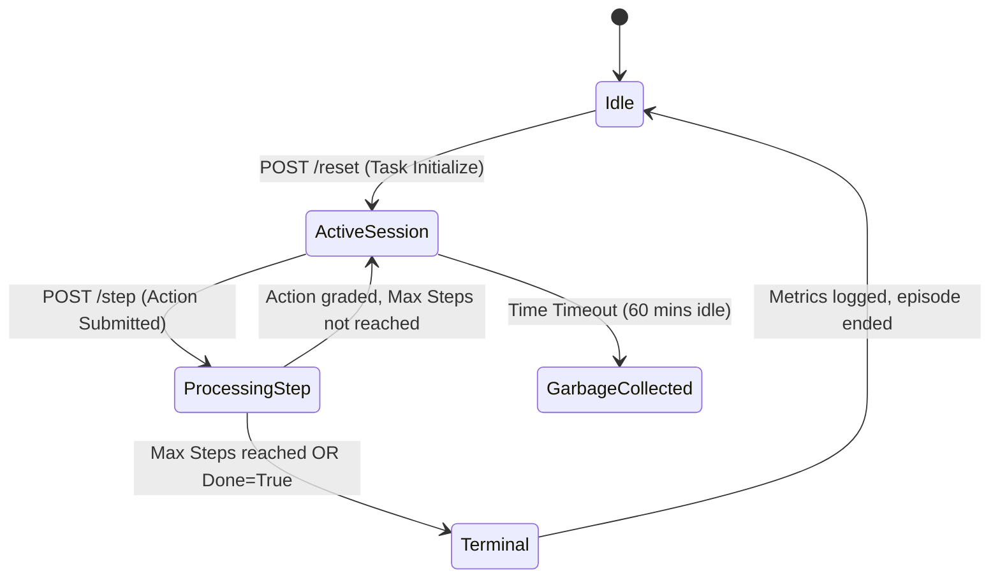

# NexDesk Ticket Triage - Architecture & UML

## Architectural Overview

The NexDesk Ticket Triage project encapsulates a robust, stateful simulation environment enclosed within a FastAPI web service, structured to be tightly compliant with the OpenEnv specifications for RLHF (Reinforcement Learning from Human Feedback) agent training.

The system is split into two logical halves:
1. **The Server-side Engine (`server/`)**: A stateless-to-the-outside API that securely locks episodes within a stateful Python object (`NexDeskEnv`). It houses the environment logic, graders, and datasets.
2. **The Client-side Protocol (`client.py`, `inference.py`)**: Responsible for acting as the LLM orchestration layer that retrieves tasks and dispatches JSON schema actions dynamically via the LLM API.

## Core Component Interactions

- **FastAPI Layer (`app.py`)**: Exposes RESTful endpoints (`/reset`, `/step`, `/state`, `/mcp`, `/metrics`) to interact with the environment. It translates HTTP requests validated via Pydantic (`models.py`) down into the simulation logic.
- **Engine Layer (`environment.py`)**: Core game-loop server. Manages the episodic history, tracks the ticking SLA timers, manages stress multipliers dynamically, and updates the step status.
- **Grader Layer (`graders.py`)**: Encapsulates deterministic evaluation logic. These scripts grant partial credit in bounded ranges `(0.01, 0.99)` based on accurate dictionary and keyword hits on the `TICKETS` dataset ground truth.
- **Metrics Engine Layer (`metrics.py`)**: Processes all historical episodic interactions to calculate global platform health, overall SLA breach counts, LLM calibration MAE (Mean Absolute Error), and simulated ROI logic. 

## UML Structure

### 1. System Context Diagram (Mermaid)

### 2. Class Diagram (Mermaid)

### 3. Episode State Machine UML (Mermaid)

